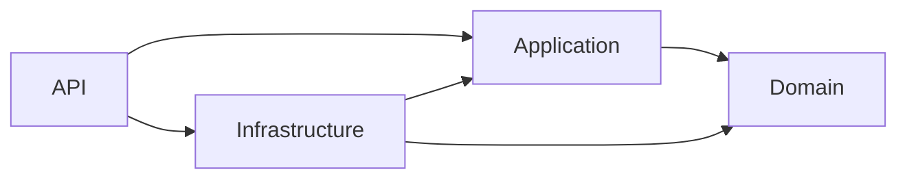

# Wallet Transfer API — Carteira Digital e Transferências


API REST para gerenciamento de carteiras digitais e transferências financeiras entre usuários comuns e lojistas.

Projeto back-end desenvolvido em **.NET 10 e C# 14**, com foco em regras de negócio, consistência transacional, integração com serviços externos, testes automatizados e organização baseada em Clean Architecture.

> **Status:** em desenvolvimento. A estrutura inicial da solução está concluída; as funcionalidades descritas abaixo serão implementadas progressivamente.

---

## Sumário

- [Sobre o projeto](#sobre-o-projeto)
- [Regras de negócio](#regras-de-negócio)
- [Tecnologias utilizadas](#tecnologias-utilizadas)
- [Funcionalidades](#funcionalidades)
- [Contrato de transferência](#contrato-de-transferência)
- [Arquitetura](#arquitetura)
- [Estrutura do projeto](#estrutura-do-projeto)
- [Como executar](#como-executar)
- [Testes](#testes)
- [Boas práticas e decisões técnicas](#boas-práticas-e-decisões-técnicas)
- [Evolução planejada](#evolução-planejada)
- [Autor](#autor)

---

## Sobre o projeto

O **Wallet Transfer API** simula uma plataforma simplificada de pagamentos. Cada cliente possui uma carteira com saldo e pode participar de transferências conforme seu tipo de cadastro.

Existem dois tipos de usuário:

- **Usuário comum:** pode enviar e receber dinheiro;
- **Lojista:** pode receber dinheiro, mas não pode realizar transferências.

O principal objetivo técnico é executar transferências de forma segura e consistente, garantindo que o débito e o crédito ocorram na mesma transação. Antes da conclusão, a operação também depende da aprovação de um serviço autorizador externo.

---

## Regras de negócio

1. Todo usuário deve possuir nome completo, CPF ou CNPJ, e-mail, senha, tipo e carteira.
2. CPF/CNPJ deve ser único no sistema.
3. O endereço de e-mail deve ser único no sistema.
4. Usuários comuns podem enviar dinheiro para usuários comuns e lojistas.
5. Lojistas podem apenas receber dinheiro.
6. O valor da transferência deve ser maior que zero.
7. O pagador e o recebedor devem existir.
8. Um usuário não pode transferir dinheiro para a própria carteira.
9. O pagador deve possuir saldo suficiente.
10. A transferência deve ser aprovada pelo serviço autorizador externo.
11. Débito e crédito devem ser executados de forma atômica.
12. Após a conclusão, o recebedor deve ser notificado por um serviço externo.
13. A indisponibilidade da notificação não deve desfazer uma transferência já concluída.

---

## Tecnologias utilizadas

### Back-end

| Categoria | Tecnologia |
|---|---|
| Linguagem | C# 14 |
| Plataforma | .NET 10 LTS |
| API | ASP.NET Core Web API |
| Persistência | Entity Framework Core 10 — planejado |
| Banco de dados | PostgreSQL — planejado |
| Documentação | OpenAPI — planejado |
| Testes | xUnit |
| Containers | Docker e Docker Compose — planejado |
| Versionamento | Git e GitHub |

### Ferramentas de desenvolvimento

| Finalidade | Ferramenta |
|---|---|
| IDE | Visual Studio 2026 |
| Testes manuais da API | Insomnia |
| Banco em ambiente local | Docker Desktop |
| Controle de versão | Git |

---

## Funcionalidades

### Estrutura concluída

- Solução criada em .NET 10;
- Separação inicial em camadas;
- Projetos de testes unitários e de integração;
- Referências entre projetos configuradas;
- Arquivos de configuração do Git e do editor;
- Build inicial validado com sucesso.

### Funcionalidades planejadas

- Cadastro de usuários comuns e lojistas;
- Criação automática da carteira do usuário;
- Consulta de usuários e saldos;
- Depósito para preparação do ambiente de testes;
- Transferência entre carteiras;
- Validação das permissões de cada tipo de usuário;
- Consulta ao autorizador externo;
- Notificação do recebedor;
- Histórico e consulta de transferências;
- Tratamento global de erros;
- Documentação OpenAPI;
- Persistência em PostgreSQL;
- Execução da aplicação e do banco com containers;
- Testes unitários e de integração.

---

## Contrato de transferência

O fluxo principal deve respeitar o seguinte contrato:

```http
POST /transfer
Content-Type: application/json
```

```json
{
  "value": 100.0,
  "payer": 4,
  "payee": 15
}
```

| Campo | Descrição |
|---|---|
| `value` | Valor monetário da transferência |
| `payer` | Identificador do usuário que envia o dinheiro |
| `payee` | Identificador do usuário ou lojista que recebe o dinheiro |

### Fluxo esperado

1. Validar os dados recebidos;
2. Localizar pagador e recebedor;
3. Impedir o envio por lojistas;
4. Validar o saldo do pagador;
5. Consultar o autorizador externo;
6. Debitar o pagador e creditar o recebedor atomicamente;
7. Registrar a transferência;
8. Confirmar a transação no banco;
9. Solicitar a notificação do recebedor.

### Serviços externos

Autorização da transferência:

```http
GET https://util.devi.tools/api/v2/authorize
```

Notificação do recebedor:

```http
POST https://util.devi.tools/api/v1/notify
```

---

## Arquitetura

O projeto utiliza separação em camadas inspirada na **Clean Architecture**. As dependências apontam para as regras centrais da aplicação, mantendo o domínio independente de banco de dados, API e integrações externas.



### Responsabilidades

| Camada | Responsabilidade |
|---|---|
| `WalletTransfer.Domain` | Entidades, enums, objetos de valor e regras de negócio |
| `WalletTransfer.Application` | Casos de uso, interfaces, comandos, consultas e contratos |
| `WalletTransfer.Infrastructure` | Entity Framework, banco e integrações externas |
| `WalletTransfer.Api` | Controllers, configuração, entrada HTTP e respostas |
| `WalletTransfer.UnitTests` | Testes isolados das regras e casos de uso |
| `WalletTransfer.IntegrationTests` | Testes da API integrada à infraestrutura |

---

## Estrutura do projeto

```text
wallet-transfer-api/
├── src/
│   ├── WalletTransfer.Api/
│   ├── WalletTransfer.Application/
│   ├── WalletTransfer.Domain/
│   └── WalletTransfer.Infrastructure/
├── tests/
│   ├── WalletTransfer.UnitTests/
│   └── WalletTransfer.IntegrationTests/
├── .editorconfig
├── .gitignore
├── global.json
├── WalletTransfer.slnx
└── README.md
```

---

## Como executar

### Requisitos

- .NET SDK 10.0.401 ou versão de patch compatível;
- Git;
- Docker Desktop com Docker Compose — necessário após a inclusão do banco;
- Visual Studio 2026, Visual Studio Code ou IDE compatível;
- Insomnia, Postman ou ferramenta equivalente para testar a API.

### Clonar o repositório

```bash
git clone https://github.com/LucasFerdev/wallet-transfer-api.git
cd wallet-transfer-api
```

### Restaurar e compilar

```bash
dotnet restore
dotnet build
```

### Executar os testes

```bash
dotnet test
```

### Executar a API

```bash
dotnet run --project src/WalletTransfer.Api
```

> As instruções de banco de dados e Docker serão adicionadas após a configuração da persistência.

---

## Testes

A estratégia de testes será dividida em:

- **Testes unitários:** regras do domínio e casos de uso sem dependências externas;
- **Testes de integração:** endpoints, persistência e comportamento HTTP;
- **Testes manuais:** cenários executados pelo Insomnia durante o desenvolvimento.

Principais cenários previstos:

- transferência realizada com sucesso;
- lojista tentando enviar dinheiro;
- saldo insuficiente;
- pagador ou recebedor inexistente;
- transferência para a própria carteira;
- valor inválido;
- transferência não autorizada;
- reversão em caso de inconsistência;
- indisponibilidade do serviço de notificação;
- tentativa de cadastro com CPF/CNPJ ou e-mail duplicado.

---

## Boas práticas e decisões técnicas

- Uso de `decimal` para representar valores monetários;
- Métodos assíncronos com `async`, `await` e `CancellationToken`;
- Regras de negócio centralizadas no domínio;
- Injeção de dependência nativa do ASP.NET Core;
- DTOs separados das entidades persistidas;
- Tratamento global e padronizado de erros;
- Restrições de unicidade também garantidas pelo banco;
- Transação explícita para débito, crédito e registro da transferência;
- Segredos e credenciais mantidos fora do repositório;
- Commits pequenos e descritivos em português do Brasil;
- Testes automatizados para regras críticas.

---

## Evolução planejada

- Retentativa de notificações malsucedidas;
- Idempotência no endpoint de transferência;
- Controle de concorrência sobre o saldo das carteiras;
- Logs estruturados e rastreamento das operações;
- Health checks da API e do banco;
- Pipeline de integração contínua;
- Métricas e observabilidade.

---

## Autor

**Lucas Fernando da Silva**

[LinkedIn](https://www.linkedin.com/in/lucasferdev/) · [GitHub](https://github.com/LucasFerdev)
